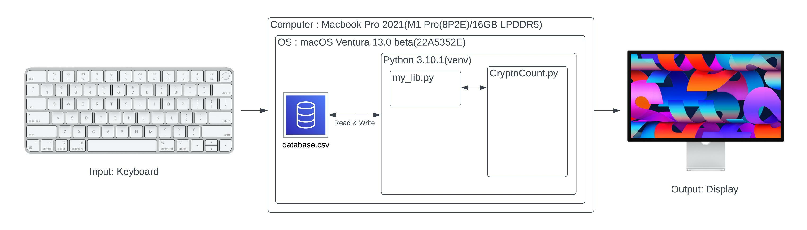

# Crypto Wallet

Cryptocurrency Wallet by Framination on Dribble

# Criteria A: Planning

## Problem definition

Ms. Sato is a local trader who is interested in the emerging market of cryptocurrencies. She has started to buy and sell electronic currencies, however at the moment she is tracking all his transaction using a ledger in a spreadsheet which is starting to become burdensome and too disorganized. It is also difficult for Ms Sato to find past transactions or important statistics about the currency. Ms Sato is in need of a digital ledger that helps her track the amount of the cryptocurrency, the transactions, along with useful statistics. 

Apart for this requirements, Ms Sato is open to explore a cryptocurrency selected by the developer.

## Proposed Solution

Design statement:
I will to design and make a **digital ledger** for a client who is **Mr Sato**. The **digital ledger** will be about **storing transactions  regarding cryptocurrency** and is constructed using the software **Python** It will take  **until Project Week** to make and will be evaluated according to the criterias below.

Justify the tools/structure of your solution
I will be using Python for this solution becasue it provides easy data scraping functions and various libraries which could help in providing useful statistics to Mr Sato

I will be choosing Ethereum(ETHUSD) as my cryptocurrency for this solution

Ethereum is a technology for building apps and organizations, holding assets, transacting and communicating without being controlled by a central authority. There is no need to hand over all your personal details to use Ethereum - you keep control of your own data and what is being shared. Ethereum has its own cryptocurrency, Ether, which is used to pay for certain activities on the Ethereum network. 
(“What Is Ethereum?” Ethereum.org, [ethereum.org/en/what-is-ethereum/.](ethereum.org/en/what-is-ethereum/.))

## Success Criteria
1. The electronic ledger is a text-based software (Runs in the Terminal).
2. The electronic ledger display the basic description of the cyrptocurrency selected.
3. The electronic ledger allows to enter, withdraw and record transactions.
4. The electronic ledger is password-protected.
5. The electronic ledger shows past records of the cryptocurrency selected up to one month.
6. The electronic ledger shows useful statistics such as overall gain/loss
7. The electronic ledger allows to convert from USD to the crypto or vice versa

## Test Plan
| Description                           | Type           | Inputs                                                                                                                                                                                                                                          | Outputs                                                                                                                                                                            |
|---------------------------------------|----------------|-------------------------------------------------------------------------------------------------------------------------------------------------------------------------------------------------------------------------------------------------|------------------------------------------------------------------------------------------------------------------------------------------------------------------------------------|
| Login & Menu                          | Unit test      | 1. Run the Project1.py  2. Input Username & Password                                                                                                                                                                                        | If the username and password matches what's stored in the user.csv file. It will transition user to the landing page which shows a menu of options                                 |
| View basic description of Crypto      | Unit test      | 1. User put in "1" into prompt following the menu                                                                                                                                                                                               | Print the basic description of the crypto that the ledger is based on                                                                                                              |
| View wallet balance                   | Unit test      | 1. User put in "2" into prompt following the menu                                                                                                                                                                                               | Prints the balance of the wallet from the wallet.csv and reference the current price of the crypto and prints that as well                                                         |
| Enter, Withdraw, Record a Transaction | Unit test      | 1. User put in "3" into prompt following the menu  2. User inputs a number from 1 to 3 to select the function they want(enter, withdraw or record)   3.User inputs amount of crypto changed   4. User inputs the date of transaction | Program will enter, withdraw or record a transaction based on the selection and input of user and writes or removes data accordingly on wallet.csv                                 |
| View Past Records of the Crypto       | Unit test      | 1. User put in "4" into prompt following the menu                                                                                                                                                                                               | Program will query the yahoo finance platform the the data of the past month and print it in the terminal in a table format.                                                       |
| View Useful Statistics                | Unit test      | 1. User put in "5" into prompt following the menu                                                                                                                                                                                               | Program will query the yahoo finance platform through the plugin yfinance and print data such as 52 week highs/lows and overall gains/losses with reference to the wallet.csv file |
| Exit Function                         | Unit test      | 1. User put in "6" into prompt following the menu                                                                                                                                                                                               | Program quits                                                                                                                                                                      |
| Date input validation                 | Usability test | 1. User input wrong date or wrongly formatted date (not YYYY-MM-DD) into prompt when entering, withdrawing or recording a transaction                                                                                                           | Program prompts user that date input is wrong and prompts user to input again.                                                                                                     |
| Number input validation               | Usability test | 1. User input invalid characters into the prompt when asked to put in number(either int/float)                                                                                                                                                  | Program prompts user that the input is invalid and prompts user to input again.                                                                                                    |
| Wrong password counter                | Usability test | 1. User inputs wrong username/password when logging in                                                                                                                                                                                          | Program prompts user to retry logging in. When the amount of times the username/password is wrong exceeds 3, the program terminates itself.                                        |

# Criteria B: Design

## System Diagram

*Fig.1* **System diagram of this program**

## Flow Diagrams

### Login

*Fig.2* **Flow diagram of the login function**

### Wallet Balance

*Fig.3* **Flow diagram of the wallet balance function**

### Withdrawing Transactions

*Fig.4* **Flow diagram of the withdrawing transactions function**

## Record of Tasks(3 Functional Test + 3 Non-Functional Test)
| Task No | Planned Action                  | Planned Outcome                                                                          | Time estimate | Target completion date | Criterion |
|---------|---------------------------------|------------------------------------------------------------------------------------------|---------------|------------------------|-----------|
| 1       | Create system diagram           | To have a clear idea of the hardware and software requirements for the proposed solution | 10min         | Sep 22                 | B         |
| 2       | Interview with the Client       | To discuss client's needs and define success criteria                                    | 5min          | Sep 23                 | A         |
| 3       | Code the Menu                   | To have menu items and title written on the screen                                       | 20min         | Sep 23                 | C         |
| 4       | Code authentication system      | A tested program to protect the application using a password with encryption             | 60min         | Sep 27                 | C         |
| 5       | Code Main Functions             | A function base of the program                                                           | 4hrs          | Sep 30                 | C         |
| 6       | Beautify Code and Final Touches | To finalize code and make it look nice                                                   | 2hrs          | Oct 1                  | C         |
| 7       | Form Test Plan                  | To a flexible test plan formed                                                           | 1hr           | Oct 1                  | B         |
| 8       | Draw Flow Diagrams              | To have completed the flow diagrams for the functions of the program                     | 1.5hrs        | Oct 3                  | B         |
 

## Video of the Program
[Video of the Program](https://youtu.be/1Z0Z2Z2Z2Z2)

